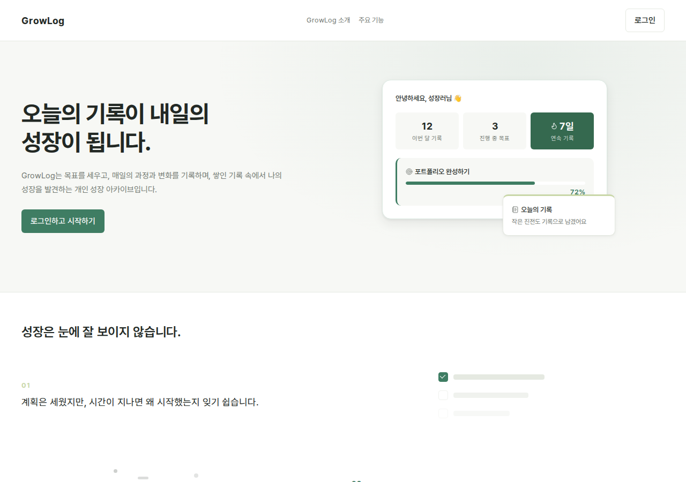
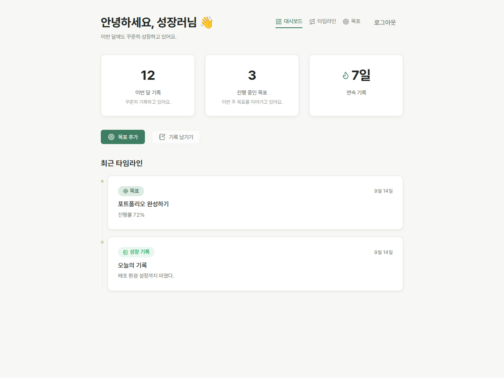
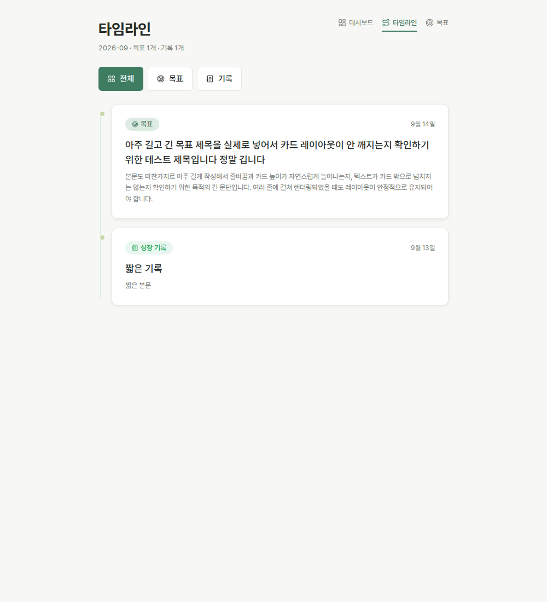
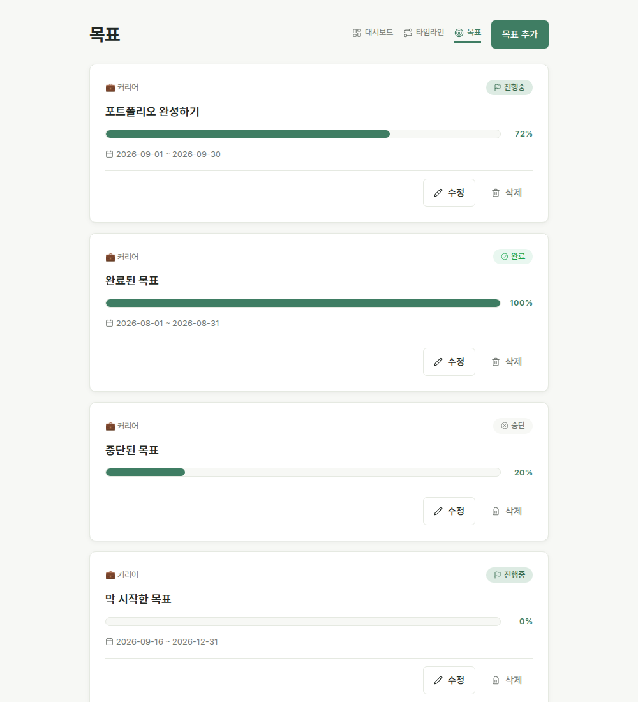
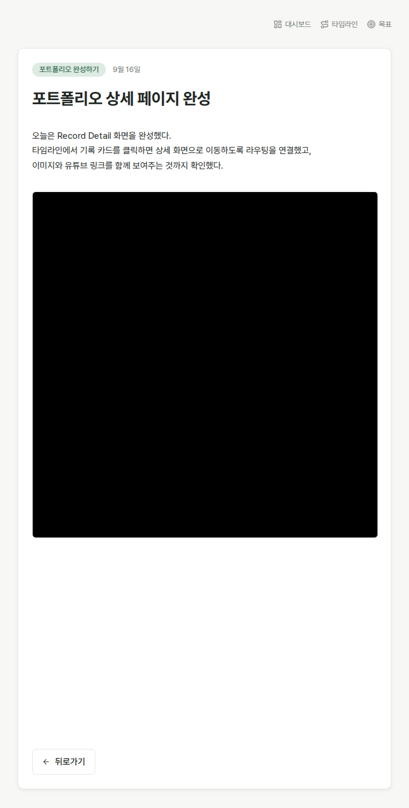

# GrowLog

> 목표와 일상의 기록을 쌓아 자신의 성장 과정을 발견하는 개인 성장 아카이브
>
> Spring Boot + JSP 기반 서비스를 Vue 3 + TypeScript SPA 구조로 리뉴얼한 프론트엔드 현대화 프로젝트


📋 기획 배경, 사용자 시나리오, 화면 설계 전체는 [Notion 기획서](https://app.notion.com/p/netu-retail/GrowLog-fc532d9b5e41415bac5c9b0f03ccaf2e?source=copy_link)에서 볼 수 있습니다.

---

## 대표 화면



| Dashboard | Timeline |
|---|---|
|  |  |

| Goal List | Record Detail |
|---|---|
|  |  |

Loading / Empty / Error / Validation 등 화면별 다른 상태는 [`docs/screenshots/`](docs/screenshots/)에 더 있습니다.

---

## 왜 리뉴얼했는가

기존 GrowLog는 Spring Boot + JSP였습니다. 화면을 옮길 때마다 서버가 페이지 전체를 다시 렌더링해야 했고, 그 구조에서는 Loading / Empty / Error 같은 세밀한 상태 UX나 클라이언트 상태 관리를 만들기 어려웠습니다.

반면 `GoalService` / `GrowthRecordService` / `MediaService`와 그 아래 Entity·Repository 계층은 이미 검증된 비즈니스 로직을 갖고 있었습니다. 그래서 **Backend를 다시 작성하는 대신, 기존 Service 계층은 그대로 재사용하면서 Frontend만 Vue 3 + TypeScript SPA로 현대화**하는 것을 리뉴얼의 목표로 잡았습니다.

**Renewal 목표**

- JSP 기반 화면을 Vue SPA로 전환
- Frontend / Backend 역할 분리 (Vue SPA + REST API)
- TypeScript 기반 API Contract
- 기존 Spring Security Session 인증 유지
- Loading / Empty / Error / Validation UX 보완
- Responsive / Accessibility 개선
- Production 환경 설정까지 검증

### Before / After

```text
Before                  After

Spring MVC              Vue 3 SPA
   ↓                       ↓
Controller               Axios
   ↓                       ↓
JSP (서버 렌더링)        REST API (JSON)
                            ↓
                          기존 Service 계층 (재사용)
                            ↓
                          JPA / MySQL
```

> Backend를 새로 작성하지 않고 기존 Service Layer를 재사용하며 Frontend Layer만 현대화했습니다. `GoalApiController`, `GrowthRecordApiController`처럼 새로 추가한 Controller는 전부 기존 Service 메서드를 그대로 호출하는 얇은(thin) REST 레이어입니다.

---

## Tech Stack

| 영역 | 기술 |
|---|---|
| Frontend | Vue 3 (Composition API), TypeScript, Vite, Vue Router, Pinia, Axios |
| Backend | Spring Boot, Spring Security, JPA, MySQL |
| Infra | AWS RDS, AWS S3 |
| UI | Pretendard, Lucide Icons |

---

## Frontend Architecture

```text
View
 ↓
API Layer (frontend/src/api/)
 ↓
Axios Instance (frontend/src/api/axios.ts)
 ↓
Spring REST API
```

**상태 관리 기준**

```text
여러 화면이 공유하는 상태   → Pinia   (frontend/src/stores/auth.store.ts, 로그인 사용자 정보뿐)
화면 하나에서만 쓰는 상태   → Local State (모달, 폼, 필터 등)
```

- API 파일을 기능별로 분리(`auth.api.ts` / `dashboard.api.ts` / `goal.api.ts` / `timeline.api.ts` / `record.api.ts`)하고, 응답 타입은 `frontend/src/types/`에서 API와 1:1로 관리
- **Router Guard**(`frontend/src/router/index.ts`)는 네비게이션 시작 시점의 인증 여부만 판단하고, **Axios 401 Interceptor**(`frontend/src/api/interceptors.ts`)는 이미 인증된 화면에서 세션이 도중에 끊겼을 때만 반응 — 두 메커니즘의 역할을 명확히 분리
- 에러 처리 책임: API 공통(세션 만료) → Interceptor / 화면 단위(조회 실패) → 각 View / 폼 단위(제출 실패·검증) → 해당 Form

구조에 대한 더 자세한 리뷰는 [`docs/decisions.md`](docs/decisions.md)에 정리되어 있습니다.

---

## Authentication Flow

```text
Login
 ↓
Spring Security
 ↓
Session 생성 (JSESSIONID Cookie)
 ↓
GET /api/me
 ↓
Pinia Auth Store
```

Cross-Origin SPA(Vite :5173 → Spring Boot :8080)에서 세션 쿠키가 정상 동작하도록 `withCredentials`, CSRF 쿠키/헤더 자동 매핑, `SameSite=None; Secure`, CORS Origin 화이트리스트를 함께 맞췄습니다.

> 기존 Spring Security Session 인증을 재사용하는 것이 리뉴얼 목적에 더 적합하다고 판단해 JWT로 전환하지 않았습니다.

---

## Key Features

| 영역 | 내용 |
|---|---|
| Landing | Product Storytelling, Responsive, Motion / Reduced Motion |
| Dashboard | 실제 사용자 데이터 기반 Summary, 최근 Timeline, Loading / Error / Empty |
| Timeline | Goal / Record 통합 흐름, Record Detail 연결 |
| Goal | List / Create / Update / Delete, Validation, Progress |
| Record | Timeline → Record Detail Read, Image / YouTube Media 표시 |
| Auth | Login / Logout / Current User, Protected Route, Session Restore |

---

## UX Decisions

- **Landing** — Expressive Product Storytelling: 서비스 목적과 브랜드 전달을 위해 시각 표현을 강화
- **Application**(Dashboard / Timeline / Goal / Record) — Calm / Focus / Information: 반복 사용성을 위해 정보 인식과 안정성을 우선
- Design Token 기반 색상 체계, Loading Skeleton, Empty / Error 상태, `prefers-reduced-motion`, hover 전용 상호작용 제거(`@media (hover: hover)`) 적용

---

## Troubleshooting

전체 기록은 [`docs/trouble_shooting/`](docs/trouble_shooting/)에 날짜별로 있습니다. 그중 리뉴얼 과정을 대표하는 3건만 남깁니다.

**1. Login POST 403 — CSRF / Axios XSRF**
Cross-Origin으로 보내는 로그인 요청에 CSRF 토큰이 실리지 않아 403이 발생했습니다. `CookieCsrfTokenRepository`로 토큰을 쿠키로 내려주고 Axios의 `xsrfCookieName` / `xsrfHeaderName` / `withXSRFToken`을 맞춰 자동으로 헤더에 실리게 했습니다. CSRF 토큰이 서버에 "존재하는 것"과 요청에 "전달되는 것"은 다른 문제라는 걸 확인한 사례입니다.

**2. 로그인 성공 후 `GET /api/me` 401 — Session Cookie / SameSite**
세션 쿠키의 기본 `SameSite=Lax`는 Cross-Origin 요청에 쿠키를 실어 보내지 않습니다. `SameSite=None; Secure`로 명시해 해결했습니다. 로그인 자체의 성공/실패와 그 이후 요청이 세션을 유지하는지는 별개 문제라는 걸 실감했습니다.

**3. Public Landing 401 Redirect — Router Guard / Interceptor 책임 분리**
Axios 401 Interceptor가 모든 401을 동일하게 처리해서, 비로그인 상태 확인용 `GET /api/me`의 401까지 "세션 끊김"으로 오판해 공개 페이지에서도 로그인 화면으로 튕겨 나갔습니다. Interceptor에서 `/api/me` 요청만 제외해 역할을 분리했습니다. 같은 401이라도 어떤 요청에서 왔는지에 따라 의미가 다를 수 있다는 걸 배운 사례입니다.

---

## Architecture Decisions

| Decision | Reason |
|---|---|
| Vue 3 | JSP 화면을 SPA로 리뉴얼, Composition API로 상태/템플릿을 한 파일에서 관리 |
| TypeScript | API 응답과 화면 데이터의 계약을 명시적으로 고정 |
| Pinia | 여러 화면이 공유하는 인증 상태만 전역으로 분리 |
| Session 유지 | 기존 Spring Security 인증 구조를 그대로 재사용 |
| Thin REST Controller | 기존 Service 계층 재사용, Backend 재작성 없음 |
| Local State 우선 | 화면 전용 상태를 전역으로 승격하지 않음 |

상세 내용은 [`docs/decisions.md`](docs/decisions.md)에 있습니다.

---

## Quality / Validation

- Frontend: `npm run build` 통과 (TypeScript `noUnusedLocals`/`noUnusedParameters` 포함)
- Backend: `mvn test` **40/40 통과**
- Responsive: 6개 화면 × 6개 뷰포트(1440 / 1200 / 1024 / 768 / 390 / 360) 전부 horizontal overflow 없음
- Route: Protected Route 인증 가드, 새로고침 시 세션 복원, 세션 만료 시 리다이렉트, 잘못된 URL 접근 시 404 처리 확인

---

## Project Structure

```text
frontend/src
├─ api
├─ components
├─ composables
├─ router
├─ stores
├─ types
├─ utils
└─ views
```

```text
src/main/java
├─ controller
├─ service
├─ repository
└─ entity
```

---

## Run Locally

**Backend**

```bash
cp env.sh.example env.sh   # DB_PASSWORD, MAIL_PASSWORD 등 채우기
source env.sh
./mvnw spring-boot:run
```

**Frontend**

```bash
cd frontend
npm install
npm run dev
```

`frontend/.env.development`에 로컬 백엔드 주소가 이미 설정되어 있어 별도 설정 없이 바로 실행됩니다. 실제 비밀번호/키는 README나 저장소에 작성하지 않고 `env.sh` / `env.bat`(둘 다 `.gitignore`에 등록)로만 관리합니다.

---

## Documentation

- Architecture Decisions → [`docs/decisions.md`](docs/decisions.md)
- Troubleshooting (전체) → [`docs/trouble_shooting/`](docs/trouble_shooting/)
- Interview Preparation → [`docs/interview-prep.md`](docs/interview-prep.md)
- Screenshots → [`docs/screenshots/`](docs/screenshots/)

### Future Improvements

Badge/통계/AI 요약/Community/Record Create·Edit Vue 전환/새 Dashboard Widget은 이번 Portfolio Scope에 포함하지 않았습니다. 현재 범위를 기능 개수가 아니라 Legacy Modernization / Frontend Architecture / Security Integration / Production 완성도로 고정했기 때문입니다.
