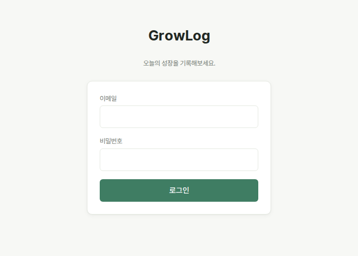

# GrowLog

> 목표와 일상의 기록을 쌓아 자신의 성장 과정을 발견하는 개인 성장 아카이브


## 📋 프로젝트 기획서

GrowLog의 기획 배경, 주요 기능, 사용자 시나리오 및 화면 설계는
아래 Notion 문서에서 확인할 수 있습니다.

[👉 GrowLog 프로젝트 기획서 보러 가기](https://app.notion.com/p/netu-retail/GrowLog-fc532d9b5e41415bac5c9b0f03ccaf2e?source=copy_link)

---

## 프로젝트 배경

GrowLog는 원래 Spring Boot + JSP로 만든 목표·성장 기록 서비스였다.
JSP 기반 구조는 화면을 옮길 때마다 서버가 페이지 전체를 다시
렌더링해야 해서, 로딩/에러/빈 상태 같은 세밀한 UX나 클라이언트
상태 관리를 만들기 어려웠다.

반면 `GoalService`/`GrowthRecordService`/`MediaService`와 그 아래
Entity·Repository 계층은 이미 검증된 비즈니스 로직을 갖고 있었다.
그래서 이 프로젝트의 리뉴얼은 **Backend를 다시 만드는 것이 아니라,
기존 Service 계층은 최대한 재사용하면서 Frontend만 Vue 3 +
TypeScript SPA로 현대화**하는 것을 목표로 진행했다.

## Renewal 목표

- Frontend/Backend 관심사 분리 (Vue SPA + REST API)
- SPA Interaction — 화면 전환 시 전체 새로고침 없이 상태 유지
- Type Safety — API 응답과 화면 데이터의 계약을 TypeScript로 명시
- Client State Management — 전역/로컬 상태 경계를 명확히
- UX 개선 — Loading/Empty/Error/Validation 상태를 모든 화면에서 완성
- Responsive — Desktop/Tablet/Mobile 대응
- Production-ready Frontend — 실제 배포를 기준으로 한 빌드/설정

## Tech Stack

**Frontend**
Vue 3 (Composition API), TypeScript, Vite, Vue Router, Pinia, Axios

**Backend**
Spring Boot, Spring Security (Session 기반 인증), JPA, MySQL(AWS RDS), AWS S3

> JWT로 전환하지 않았다. 리뉴얼의 목적이 인증 구조 재작성이 아니라
> 프론트엔드 현대화였고, 기존 Spring Security 세션 인증이 이미
> 안정적으로 동작하고 있었기 때문이다. (자세한 이유는
> [docs/interview-prep.md](docs/interview-prep.md) 4번 참고)

---

## Before / After

```text
Before                        After
Spring MVC                    Vue 3 SPA
  ↓                             ↓
Controller                    Axios
  ↓                             ↓
JSP (서버 렌더링)              REST API (JSON)
                                 ↓
                               기존 Service 계층 (그대로 재사용)
                                 ↓
                               JPA / MySQL
```

핵심 메시지: **Backend Rewrite가 아니라, 기존 Service 계층을 유지한
채 Frontend Layer만 현대화했다.** `GoalApiController`,
`GrowthRecordApiController`처럼 새로 추가한 Controller는 모두 기존
Service 메서드를 그대로 호출하는 얇은(thin) REST 레이어다.

---

## 주요 화면

| Landing | Dashboard |
|---|---|
|  |  |

| Timeline | Goal List |
|---|---|
|  |  |

| Record Detail | Login |
|---|---|
|  |  |

Loading/Empty/Error/Validation 등 각 화면의 다른 상태는
`docs/screenshots/day11/`, `docs/screenshots/day13/`,
`docs/screenshots/day14/`에 더 있다.

---

## Architecture Decisions

- **왜 Vue?** 화면 대부분이 서버 데이터 fetch + 폼으로 구성돼 있어,
  `<script setup>`이 상태와 템플릿을 한 파일에서 바로 대응시켜
  보여주는 구조가 이 프로젝트 규모에 잘 맞았다.
- **왜 TypeScript?** `types/goal.ts`, `types/timeline.ts`처럼 API
  응답과 화면에서 쓰는 데이터의 모양을 명시적인 계약으로 만들어,
  백엔드 응답이 바뀌면 컴파일 타임에 바로 드러나게 했다.
- **왜 Pinia?** 여러 화면이 동시에 참조하는 로그인 사용자 정보
  (`auth.store`)만 전역으로 두고, 나머지(모달 상태, 폼 상태, 필터
  선택 등)는 컴포넌트 로컬 상태로 남겼다.
- **왜 Session 유지?** 기존 Spring Security 인증 구조를 그대로
  재사용하기 위함이다. `CookieCsrfTokenRepository` + Axios
  XSRF 자동 처리, `SameSite=None; Secure` 세션 쿠키로 Cross-Origin
  SPA에서도 정상 동작하도록 맞췄다.
- **왜 JWT로 전환하지 않았나?** 리뉴얼의 목적이 인증 Backend
  Rewrite가 아니었기 때문이다.

Frontend 아키텍처(Pinia 범위, API 레이어, 타입 구조, 에러 처리
책임 분리, Router Guard와 Axios Interceptor의 역할 분리)에 대한
더 자세한 리뷰는 [docs/decisions.md](docs/decisions.md)의 Day 12
항목에 정리되어 있다.

---

## Troubleshooting (선정 4건)

전체 트러블슈팅 기록은 [docs/trouble_shooting/](docs/trouble_shooting/)에
날짜별로 있다. 그중 리뉴얼 과정을 대표하는 4건만 추린다.

### 1. Login POST 요청이 403 Forbidden으로 실패

- **Problem**: 로그인 버튼을 눌러도 브라우저 콘솔에 403이 찍혔다.
- **Cause**: Spring Security가 상태 변경 요청에 기본으로 CSRF
  보호를 적용하는데, Cross-Origin으로 보내는 Axios 요청에는 CSRF
  토큰이 실려 있지 않았다.
- **Solution**: `CookieCsrfTokenRepository.withHttpOnlyFalse()`로
  토큰을 XSRF-TOKEN 쿠키로 내려주고, Axios 인스턴스에
  `xsrfCookieName`/`xsrfHeaderName`/`withXSRFToken: true`를 설정해
  자동으로 헤더에 실리게 했다.
- **Learning**: CSRF 토큰이 서버에 "존재하는 것"과 그 토큰이 실제
  요청에 "전달되는 것"은 다른 문제다. Spring Security는 토큰을
  지연 로딩하기 때문에, 누군가 실제로 `csrfToken.getToken()`을
  호출해야 쿠키가 응답에 실린다 — JSP는 `${_csrf.token}` 렌더링이
  그 역할을 했지만, SPA에는 그런 코드가 없어서 별도 필터
  (`csrfCookieFilter`)로 매 요청마다 강제로 읽어야 했다.

### 2. 로그인 성공 직후 `GET /api/me`가 401을 반환

- **Problem**: 로그인 API는 성공 응답을 줬는데, 이어서 호출한
  `/api/me`가 401을 반환해 로그인 상태를 화면에 반영할 수 없었다.
- **Cause**: 세션 쿠키의 기본 `SameSite` 값(Lax)은 Cross-Origin
  XHR/fetch 요청에는 method와 무관하게 쿠키를 아예 안 실어 보낸다.
  Vue 개발 서버(5173)와 Spring Boot(8080)는 다른 Origin이라 이
  제약에 걸렸다.
- **Solution**: 세션 쿠키를 `SameSite=None; Secure`로 명시했다.
  `Secure` 속성이 필요하지만, 최신 브라우저는 `http://localhost`를
  안전한 컨텍스트로 취급해 로컬 개발에서도 정상 동작한다 — 실제
  배포에서는 프론트/백엔드 모두 HTTPS를 쓰므로 그대로 유효하다.
- **Learning**: 로그인 자체의 성공/실패와, 그 뒤에 이어지는 요청이
  세션을 유지하는지는 완전히 다른 문제다. 쿠키 정책(SameSite)은
  브라우저마다 조용히 요청을 막기 때문에 네트워크 탭에서 쿠키가
  실제로 전송됐는지 먼저 확인하는 습관이 필요했다.

### 3. Public Landing 페이지에서 의도치 않게 로그인 화면으로 리다이렉트

- **Problem**: 로그인하지 않은 사용자가 `/`(Landing, 공개 페이지)에
  들어왔는데 곧바로 `/login`으로 튕겨 나갔다.
- **Cause**: Axios 401 Interceptor가 모든 401 응답을 동일하게
  처리해서, Router Guard가 세션 확인을 위해 호출하는
  `GET /api/me`의 401(비로그인 상태를 알리는 정상 응답)까지
  "세션이 끊겼다"고 오판해 `/login`으로 보냈다.
- **Solution**: Interceptor에서 요청 URL이 `/api/me`인 경우는
  명시적으로 제외했다. `/api/me`의 401 처리는 이미
  `authStore.fetchCurrentUser()`가 자체적으로(조용히 `user = null`)
  담당하고 있었으므로, Interceptor는 "이미 인증된 화면에서 세션이
  도중에 끊긴" 경우만 담당하도록 역할을 분리했다.
- **Learning**: 같은 HTTP 상태 코드(401)라도 어떤 요청에서 왔는지에
  따라 의미가 다를 수 있다 — "아직 로그인 안 한 상태를 확인하는
  중"과 "로그인했던 세션이 끊김"을 구분하지 않으면 공개 페이지에도
  인증 요구가 새어 들어간다.

### 4. Day 14 — 문서에는 있지만 코드에는 없었던 운영 프로필

- **Problem**: 과거 트러블슈팅 문서(`260730.md`)에는 "로컬과 운영
  프로필을 분리했다"고 적혀 있었지만, Day 14에 다시 코드를
  확인하니 `spring.profiles.active`를 설정하는 곳도,
  `application-prod.yaml`도 실제로는 존재하지 않았다.
- **Cause**: 로컬 개발용으로 튜닝된 단일 `application.yaml`
  (`ddl-auto: update`, `show-sql: true`, CORS 기본값이
  `localhost:5173`)이 프로필 구분 없이 그대로 운영에도 나갈 수
  있는 상태였다.
- **Solution**: `application-prod.yaml`을 추가해 `ddl-auto:
  validate`, `show-sql: false`, CORS 기본값 제거(누락 시 기동
  실패)만 오버라이드했다. `SPRING_PROFILES_ACTIVE=prod`로
  활성화한다.
- **Learning**: 트러블슈팅 문서에 "해결했다"고 적혀 있어도 실제
  코드가 그 상태를 유지하고 있는지는 별개로 확인해야 한다 — 문서와
  코드가 갈라질 수 있다는 걸 실감한 사례였다. (자세한 내용:
  [docs/trouble_shooting/260916.md](docs/trouble_shooting/260916.md) 3번)

---

## UX / Design Decisions

GrowLog 안에서도 화면의 성격에 따라 톤을 의도적으로 나눴다.

- **Landing (Expressive)**: 서비스를 처음 만나는 화면이라 Product
  Storytelling(Why GrowLog → Hero → Feature → Growth Journey → CTA),
  스크롤 reveal 모션, Primary Green 컬러 리듬을 적극적으로 썼다.
- **Application (Calm / Focus / Information)**: Dashboard/Timeline/
  Goal/Record Detail처럼 실제로 매일 쓰는 화면은 장식을 절제하고
  정보 인식 속도를 우선했다 — 새 색 토큰을 추가하지 않고 기존
  Primary Green과 중립 톤 안에서 상태(진행중/완료/중단, 목표/기록)를
  구분했다.
- **Progressive Enhancement**: `prefers-reduced-motion`을 감지해
  Landing의 스크롤 reveal과 LoadingSkeleton의 shimmer 애니메이션을
  끌 수 있게 했고, 꺼졌을 때도 콘텐츠 자체는 항상 완전히 보이는
  상태를 기본값으로 뒀다 — 애니메이션이 콘텐츠를 숨기는 방식으로
  설계하지 않았다.
- **Responsive**: 모든 화면을 좁은 뷰포트(390px 근처)에서
  Playwright로 스크린샷을 찍어 가로 스크롤 여부를 검증하는 걸
  기본 절차로 삼았다.

---

## 면접 대비 / 향후 계획

- 자주 나올 수 있는 질문 15개에 대한 답변 정리:
  [docs/interview-prep.md](docs/interview-prep.md)
- 리뉴얼 진행 중 내린 기술적 판단과 이유(Day 1~14):
  [docs/decisions.md](docs/decisions.md)

### Future Improvements

아래 기능들은 이번 Portfolio Scope에서는 구현하지 않았다. 현재
범위를 "기능 개수"가 아니라 Legacy Modernization / Frontend
Architecture / Security Integration / Production 완성도를 보여주는
것으로 고정했기 때문이다.

- Badge / 업적 시스템
- 통계 대시보드 (월별/카테고리별 시각화)
- AI 기반 회고 요약
- Community(다른 사용자와 기록 공유)
- Record Create/Edit Vue 전환 (현재는 기존 JSP 화면 유지)
- 새로운 Dashboard Widget
